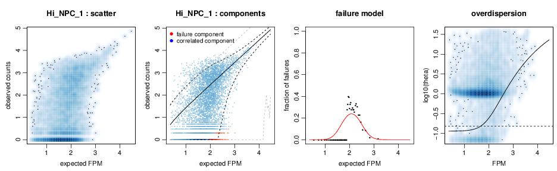
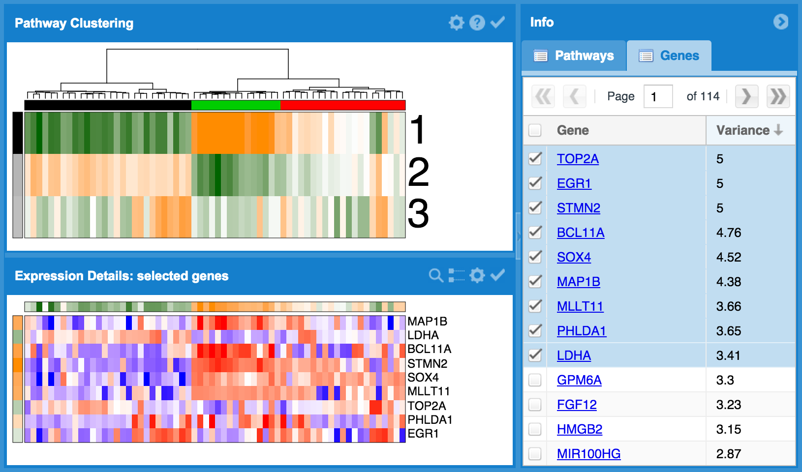

# Overview of SCDE

The `scde` package implements a set of statistical methods for analyzing single-cell RNA-seq data. `scde` fits individual error models for single-cell RNA-seq measurements. These models can then be used for assessment of differential expression between groups of cells, as well as other types of analysis. The `scde` package also contains the `pagoda` framework which applies pathway and gene set overdispersion analysis to identify aspects of transcriptional heterogeneity among single cells. 
  
The overall approach to the differential expression analysis is detailed in the following publication:  
["Bayesian approach to single-cell differential expression analysis" (Kharchenko PV, Silberstein L, Scadden DT, Nature Methods, doi:10.1038/nmeth.2967)](http://www.nature.com/nmeth/journal/v11/n7/abs/nmeth.2967.html)

The overall approach to pathways and gene set overdispersion analysis is detailed in the following publication:
"Characterizing transcriptional heterogeneity through pathway and gene set overdispersion analysis" (Fan J, Salathia N, Liu R, Kaeser G, Yung Y, Herman J, Kaper F, Fan JB, Zhang K, Chun J, and Kharchenko PV) COMING SOON!

# Sample analyses and images

## Single cell error modeling
<table>
  <tr>
    <td width=400px>
      
    </td>
    <td>
      <code>scde</code> fits individual error models for single cells using counts derived from single-cell RNA-seq data to estimate drop-out and amplification biases on gene expression magnitude.
    </td>
  </tr>
</table>

## Differential expression analysis
<table>
  <tr>
    <td width=250px>
      
    </td>
    <td>
      <pre>
             lb   mle     ub    ce     Z    cZ
Dppa5a    8.075 9.965 11.541 8.075 7.160 5.968
Pou5f1    5.357 7.208  9.178 5.357 7.160 5.968
Gm13242   5.672 7.681  9.768 5.672 7.159 5.968
Tdh       5.829 8.075 10.281 5.829 7.159 5.968
Ift46     5.435 7.366  9.217 5.435 7.150 5.968</pre>
       
      <code>scde</code> compares groups of single cells and tests for differential expression, taking into account variability in the single cell RNA-seq data due to drop-out and amplification biases in order to identify more robustly differentially expressed genes. 
    </td>
  </tr>
</table>

## Pathway and gene set overdispersion analysis
<table>
  <tr>
    <td width=400px>
       
    </td>
    <td>
      <code>scde</code> contains <code>pagoda</code> routines that characterize aspects of transcriptional heterogeneity in populations of single cells using pre-defined gene sets as well as 'de novo' gene sets derived from the data. Significant aspects are used to cluster cells into subpopulations. A graphical user interface can be deployed to interactively explore results. 
    </td>
  </tr>
</table>
    
---
    
**For more information, please visit [the SCDE website ☞](http://hms-dbmi.github.io/scde/)**

`scde` is maintained by [Jean Fan](https://github.com/jefworks) of the [Kharchenko Lab](http://pklab.med.harvard.edu/) at the [Department of Biomedical Informatics at Harvard Medical School](https://github.com/hms-dbmi).

---

# Contributing

We welcome any bug reports, enhancement requests, and other contributions. To submit a bug report or enhancement request, please use the [`scde` GitHub issues tracker](https://github.com/hms-dbmi/scde/issues). For more substantial contributions, please fork this repo, push your changes to your fork, and submit a pull request with a good commit message. For more general discussions or troubleshooting, please consult the [`scde` Google Group](http://hms-dbmi.github.io/scde/help.html).  
