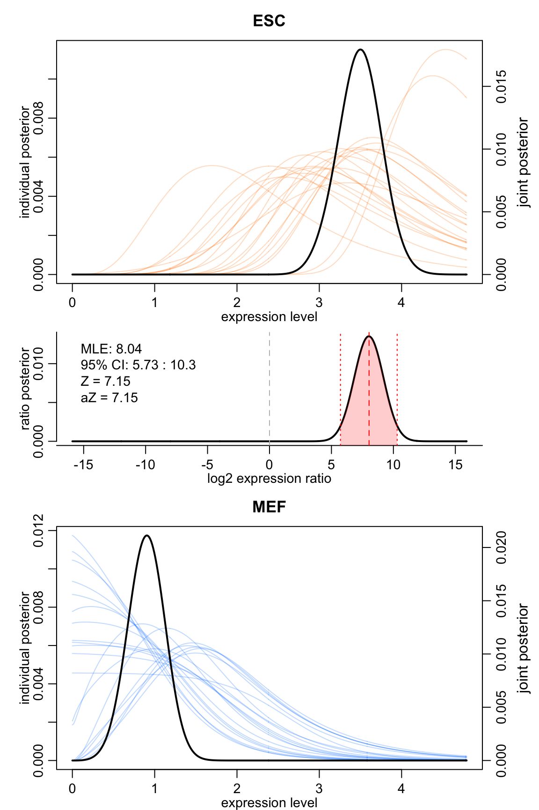
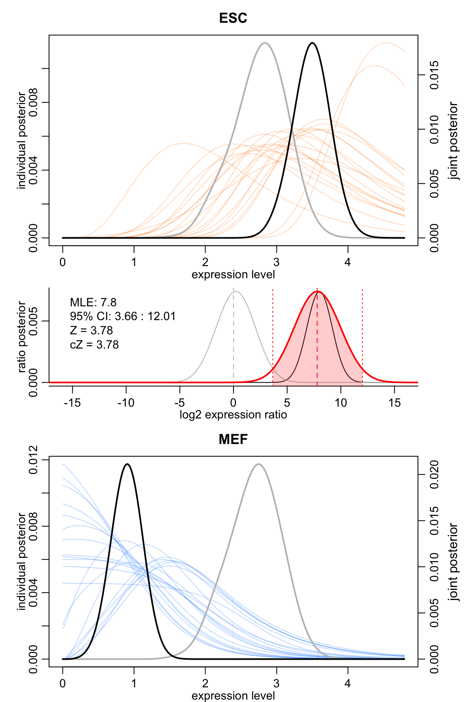

# Single-Cell Differential Expression Analysis

In this vignette, we show you how perform single cell differential expression analysis using single cell RNA-seq data. 

The `scde` package implements routines for fitting individual error models for single-cell RNA-seq measurements. Breifly, the read counts observed for each gene are modeled using a mixture of a negative binomial (NB) distribution (for the amplified/detected transcripts) and low-level Poisson distribution (for the unobserved or background-level signal of genes that failed to amplify or were not detected for other reasons). These models can then be used to identify robustly differentially expressed genes between groups of cells. 

## Preparing data

The analysis starts with a matrix of read counts. Depending on the protocol, these may be raw numbers of reads mapped to each gene, or count values adjusted for potential biases (sequence dependency, splice variant coverage, etc. - the values must be integers). The `scde` package includes a subset of the ES/MEF cell dataset published by [_Islam et al._](http://www.ncbi.nlm.nih.gov/pubmed/?term=24363023). The subset includes first 20 ES and MEF cells. Here we load the cells and define a factor separating ES and MEF cell types:


```r
# load example dataset
data(es.mef.small)
# factor determining cell types
sg <- factor(gsub("(MEF|ESC).*", "\\1", colnames(es.mef.small)), levels = c("ESC", "MEF"))
# the group factor should be named accordingly
names(sg) <- colnames(es.mef.small)  
table(sg)
```

```
## sg
## ESC MEF 
##  20  20
```

```r
# clean up the dataset
cd <- es.mef.small
# omit genes that are never detected
cd <- cd[rowSums(cd)>0, ]
# omit cells with very poor coverage
cd <- cd[, colSums(cd)>1e4]
```

## Fitting error models

As a next step we fit the error models on which all subsequent calculations will rely. The fitting process relies on a subset of robust genes that are detected in multiple cross-cell comparisons. Here we supply the `groups = sg` argument, so that the error models for the two cell types are fit independently (using two different sets of "robust" genes). If the `groups` argument is omitted, the models will be fit using a common set. 

Note this step takes a considerable amount of time unless multiple cores are used. 

```r
# EVALUATION NOT NEEDED
# calculate models
o.ifm <- scde.error.models(counts = cd, groups = sg, n.cores = 1, threshold.segmentation = TRUE, save.crossfit.plots = FALSE, save.model.plots = FALSE, verbose = 1)
devtools::use_data(o.ifm)  # save for later since this step takes a long time
```

For the purposes of this vignette, the model has been precomputed and can simply be loaded.

```r
data(o.ifm)
```

The `o.ifm` is a dataframe with error model coefficients for each cell (rows):

```r
head(o.ifm)
```

Here, `corr.a` and `corr.b` are slope and intersept of the correlated component fit, `conc.*` refer to the concomitant fit, `corr.theta` is the NB over-dispersion, and `fail.r` is the background Poisson rate (fixed).

Particularly poor cells may result in abnormal fits, most commonly showing negtive `corr.a`, and should be removed:


```r
# filter out cells that don't show positive correlation with
# the expected expression magnitudes (very poor fits)
valid.cells <- o.ifm$corr.a > 0
table(valid.cells)
```

```
## valid.cells
## TRUE 
##   40
```

```r
o.ifm <- o.ifm[valid.cells, ]
```

Here, all the fits were valid.

Finally, we need to define an expression magnitude prior for the genes. Its main function, however, is to define a grid of expression magnitude values on which the numerical calculations will be carried out:


```r
# estimate gene expression prior
o.prior <- scde.expression.prior(models = o.ifm, counts = cd, length.out = 400, show.plot = FALSE)
```

Here we used a grid of 400 points, and let the maxmimum expression magnitude be determined by the default 0.999 quantile (use `max.value` parameter to specify the maximum expression magntiude explicitly - on log10 scale).

## Testing for differential expression

To test for differential expression, we first define a factor that specifies which two groups of cells are to be compared. The factor elements correspond to the rows of the model matrix (`o.ifm`), and can contain `NA` values (i.e. cells that won't be included in either group). Here we key off the the ES and MEF names.


```r
# define two groups of cells
groups <- factor(gsub("(MEF|ESC).*", "\\1", rownames(o.ifm)), levels  =  c("ESC", "MEF"))
names(groups) <- row.names(o.ifm)
# run differential expression tests on all genes.
ediff <- scde.expression.difference(o.ifm, cd, o.prior, groups  =  groups, n.randomizations  =  100, n.cores  =  1, verbose  =  1)
```

```
## comparing groups:
## 
## ESC MEF 
##  20  20 
## calculating difference posterior
## summarizing differences
```

```r
# top upregulated genes (tail would show top downregulated ones)
head(ediff[order(ediff$Z, decreasing  =  TRUE), ])
```

```
##                     lb      mle        ub       ce        Z       cZ
## Dppa5a        8.075160 9.965929 11.541570 8.075160 7.160813 5.968921
## Pou5f1        5.357179 7.208557  9.178109 5.357179 7.160333 5.968921
## Gm13242       5.672307 7.681250  9.768974 5.672307 7.159987 5.968921
## Tdh           5.829872 8.075160 10.281057 5.829872 7.159599 5.968921
## Ift46         5.435961 7.366121  9.217500 5.435961 7.150271 5.968921
## 4930509G22Rik 5.435961 7.484295  9.808365 5.435961 7.115804 5.957784
```


```r
# write out a table with all the results, showing most significantly different genes (in both directions) on top
write.table(ediff[order(abs(ediff$Z), decreasing = TRUE), ], file = "results.txt", row.names = TRUE, col.names = TRUE, sep = "\t", quote = FALSE)
```

Alternatively we can run the differential expression on a single gene, and visualize the results:


```r
scde.test.gene.expression.difference("Tdh", models = o.ifm, counts = cd, prior = o.prior)
```

```
##           lb      mle       ub       ce        Z       cZ
## Tdh 5.711698 8.035769 10.32045 5.711698 7.151497 7.151497
```

 

The top and the bottom plots show expression posteriors derived from individual cells (colored lines) and joint posteriors (black lines). The middle plot shows posterior of the expression fold difference between the two cell groups, highlighting the 95% credible interval by the red shading.

## Correcting for batch effects

When the data combines cells that were measured in different batches, it is sometimes necessary to explicitly account for the expression differences that could be explained by the batch composition of the cell groups being compared. The example below makes up a random batch composition for the ES/MEF cells, and re-test the expression difference.


```r
batch <- as.factor(ifelse(rbinom(nrow(o.ifm), 1, 0.5) == 1, "batch1", "batch2"))
# check the interaction between batches and cell types (shouldn't be any)
table(groups, batch)
```

```
##       batch
## groups batch1 batch2
##    ESC     11      9
##    MEF      8     12
```

```r
# test the Tdh gene again
scde.test.gene.expression.difference("Tdh", models = o.ifm, counts = cd, prior = o.prior, batch = batch)
```

```
##           lb      mle       ub       ce        Z       cZ
## Tdh 3.663365 7.799423 12.01426 3.663365 3.782533 3.782533
```

 

In the plot above, the grey lines are used to show posterior distributions based on the batch composition alone. The expression magnitude posteriors (top and botom plots) look very similar, and as a result the log2 expression ratio posterior is close to 0. The thin black line shows log2 expression ratio posterior before correction. The batch correction doesn't shift the location, but increases uncertainty in the ratio estimate (since we're controlling for another factor).

Similarly, batch correction can be performed when calculating expression differences for the entire dataset:


```r
# test for all of the genes
ediff.batch <- scde.expression.difference(o.ifm, cd, o.prior, groups = groups, batch = batch, n.randomizations = 100, n.cores = 1, return.posteriors = TRUE, verbose = 1)
```

```
## controlling for batch effects. interaction:
##       batch
## groups batch1 batch2
##    ESC     11      9
##    MEF      8     12
## calculating batch posteriors
## calculating batch differences
## calculating difference posterior
## summarizing differences
## adjusting for batch effects
```
