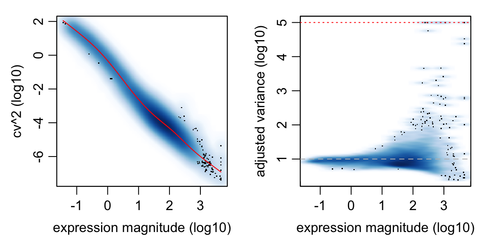
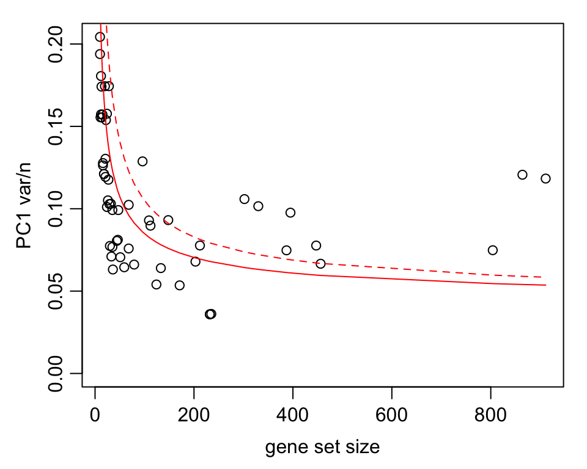
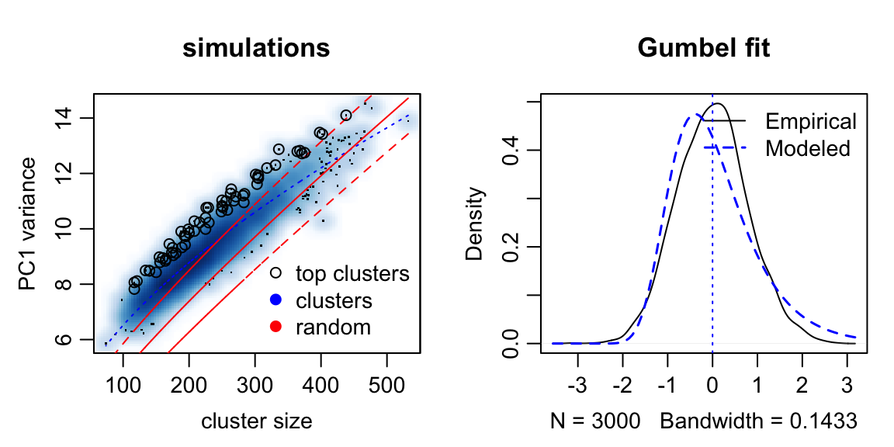
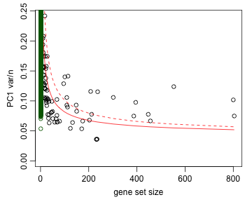
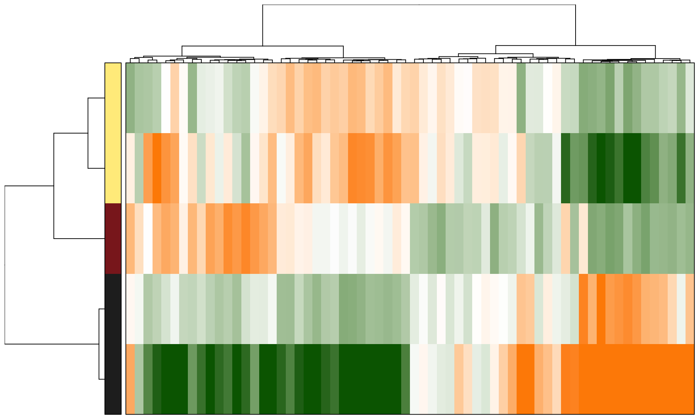
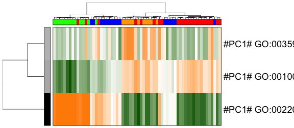
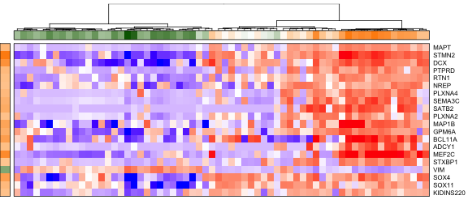

# Pathway and Gene Set Overdispersion Analysis

In this vignette, we show you how to use `pagoda` routines to characterize aspects of transcriptional heterogeneity in populations of single cells. 

The `pagoda` routines implemented in the `scde` resolves multiple, potentially overlapping aspects of transcriptional heterogeneity by identifying known pathways or novel gene sets that show significant excess of coordinated variability among the measured cells. Briefly, cell-specific error models derived from `scde` are used to estimate residual gene expression variance, and identify pathways and gene sets that exhibit statistically significant excess of coordinated variability (overdispersion). `pagoda` can be used to effectively recover known subpopulations and discover putative new subpopulations and their corresponding functional characteristics in single-cell samples.


## Preparing data

The analysis starts with a matrix of read counts. Here, we use the read count table and cell group annotations from [_Pollen et al._](www.ncbi.nlm.nih.gov/pubmed/25086649) can be loaded using the `data("pollen")` call. Some additional filters are also applied.


```r
  # read in the expression matrix
  data(pollen)
  cd <- pollen
  # filter data
  # filter out low-gene cells
  cd <- cd[, colSums(cd>0)>1.8e3]
  # remove genes that don't have many reads
  cd <- cd[rowSums(cd)>10, ]
  # remove genes that are not seen in a sufficient number of cells
  cd <- cd[rowSums(cd>0)>5, ]
  # check the final dimensions of the read count matrix
  dim(cd)
```

```
## [1] 11310    64
```

Next, we'll translate group and sample source data from [_Pollen et al._](www.ncbi.nlm.nih.gov/pubmed/25086649) into color codes. These will be used later to compare [_Pollen et al._](www.ncbi.nlm.nih.gov/pubmed/25086649)'s derived annotation with subpopulations identified by `pagoda`:


```r
# sample sources
x <- gsub("^Hi_(.*)_.*", "\\1", colnames(cd))
l2cols <- c("coral4", "olivedrab3", "skyblue2", "slateblue3")[as.integer(factor(x, levels = c("NPC", "GW16", "GW21", "GW21+3")))]
```

## Fitting error models

Next, we'll construct error models for individual cells. Here, we use k-nearest neighbour model fitting procedure implemented by `knn.error.models()` method. This is a relatively noisy dataset (non-UMI), so we raise the `min.count.threshold` to 2 (minimum number of reads for the gene to be initially classified as a non-failed measurement), requiring at least 5 non-failed measurements per gene. We're providing a rough guess to the complexity of the population, by fitting the error models based on 1/4 of most similar cells (i.e. gussing there might be ~4 subpopulations). 

Note this step takes a considerable amount of time unless multiple cores are used. 


```r
# EVALUATION NOT NEEDED
knn <- knn.error.models(cd, k = ncol(cd)/4, n.cores = 1, min.count.threshold = 2, min.nonfailed = 5, max.model.plots = 10)
devtools::use_data(knn)  # save for later since this step takes a long time
```

For the purposes of this vignette, the model has been precomputed and can simply be loaded.


```r
data(knn)
```

The fitting process above wrote out `cell.models.pdf` file in the current directory showing model fits for the first 10 cells (see `max.model.plots` argument). Here's an example of such plot:


The two scatter plots on the left show observed (in a given cell) vs. expected (from k similar cells) expression magnitudes for each gene that is being used for model fitting. The second (from the left) scatter plot shows genes belonging to the drop-out component in red. The black dashed lines show 95% confidence band for the amplified genes (the grey dashed lines show confidence band for an alternative constant-theta model). The third plot shows drop-out probability as a function of magnitude, and the fourth plot shows negative binomial theta local regression fit as a function of magnitude (for the amplified component). 

## Normalizing variance

In order to accurately quantify excess variance or overdispersion, we must normalize out expected levels of technical and intrinsic biological noise. Briefly, variance of the NB/Poisson mixture processes derived from the error modeling step are modeled as a chi-squared distribution using adjusted degrees of freedom and observation weights based on the drop-out probability of a given gene. Here, we normalize variance, trimming 3 most extreme cells and limiting maximum adjusted variance to 5.


```r
varinfo <- pagoda.varnorm(knn, counts = cd, trim = 3/ncol(cd), max.adj.var = 5, n.cores = 1, plot = TRUE)
```

 

The plot on the left shows coefficient of variance squared (on log10 scale) as a function of expression magntidue (log10 FPM). The red line shows local regression model for the genome-wide average dependency. The plot on the right shows adjusted variance (derived based on chi-squared probability of observed/genomewide expected ratio for each gene, with degrees of freedom adjusted for each gene). The adjusted variance of 1 means that a given gene exchibits as much variance as expected for a gene of such population average expression magnitude. Genes with high adjusted variance are overdispersed within the measured population and most likely show subpopulation-specific expression:


```r
# list top overdispersed genes
sort(varinfo$arv, decreasing = TRUE)[1:10]
```

```
##      DCX     EGR1      FOS  IGFBPL1   MALAT1    MEF2C    STMN2    TOP2A 
## 5.000000 5.000000 5.000000 5.000000 5.000000 5.000000 5.000000 5.000000 
##   BCL11A     SOX4 
## 4.755811 4.522795
```

## Controling for sequencing depth 

Even with all the corrections, sequencing depth or gene coverage is typically still a major aspects of variability. In most studies, we would want to control for that as a technical artifact (exceptions are cell mixtures where subtypes significantly differ in the amount of total mRNA). Below we will control for the gene coverage (estimated as a number of genes with non-zero magnitude per cell) and normalize out that aspect of cell heterogeneity: 


```r
varinfo <- pagoda.subtract.aspect(varinfo, colSums(cd[, rownames(knn)]>0))
```

## Evaluate overdispersion of pre-defined gene sets

In order to detect significant aspects of heterogeneity across the population of single cells, 'pagoda' identifies pathways and gene sets that exhibit statistically significant excess of coordinated variability. Specifically, for each gene set, we tested whether the amount of variance explained by the first principal component significantly exceed the background expectation. We can test both pre-defined gene sets as well as 'de novo' gene sets whose expression profiles are well-correlated within the given dataset. 

For pre-defined gene sets, we'll use GO annotations. 


```r
# EVALUATION NOT NEEDED. 
library(org.Hs.eg.db)
# translate gene names to ids
ids <- unlist(lapply(mget(rownames(cd), org.Hs.egALIAS2EG, ifnotfound = NA), function(x) x[1]))
# reverse map
rids <- names(ids)
names(rids) <- ids
# list all the ids per GO category
go.env <- eapply(org.Hs.egGO2ALLEGS, function(x) as.character(na.omit(rids[x])))
 # omit categories with too few genes
go.env <- go.env[unlist(lapply(go.env, length))>5]
  
# append descriptions to the GO names
library(GO.db)
desc <- unlist(lapply(mget(names(go.env), GOTERM, ifnotfound = NA), function(x) if(is.logical(x)) { return("") } else { slot(x, "Term")}))
names(go.env) <- paste(names(go.env), desc)  # append description to the names

go.env <- list2env(go.env)  # convert to an environment

devtools::use_data(go.env)  # save for later
```

An environment mapping GO terms to the set of genes contained in it has been pre-computed.


```r
data(go.env)
```

Now, we can calculate weighted first prinicpal component magnitudes for each GO gene set in the provided environment.


```r
pwpca <- pagoda.pathway.wPCA(varinfo, go.env, n.components = 1, n.cores = 1, n.internal.shuffles = 0)
```

We can now evaluate the statistical significance of the observed overdispersion for each GO gene set.


```r
df <- pagoda.top.aspects(pwpca, return.table = TRUE, plot = TRUE, z.score = 1.96)
```

 

Each point on the plot shows the PC1 variance (lambda1) magtnidue (normalized by set size) as a function of set size. The red lines show expected (solid) and 95% upper bound (dashed) magnitudes based on the Tracey-Widom model.


```r
head(df)
```

```
##                                                                          name
## 421                                        GO:0003170 heart valve development
## 422                                      GO:0003179 heart valve morphogenesis
## 426                                GO:0003208 cardiac ventricle morphogenesis
## 123  GO:0000979 RNA polymerase II core promoter sequence-specific DNA binding
## 4408                          GO:0060563 neuroepithelial cell differentiation
## 4329      GO:0060045 positive regulation of cardiac muscle cell proliferation
##      npc  n    score         z     adj.z sh.z adj.sh.z
## 421    1 13 3.049964 10.125464  9.786492   NA       NA
## 422    1 13 3.049964 10.125464  9.786492   NA       NA
## 426    1 25 2.978694 11.961732 11.627068   NA       NA
## 123    1 22 2.803050 10.666884 10.328873   NA       NA
## 4408   1 23 2.782324 10.710213 10.372253   NA       NA
## 4329   1 10 2.713999  8.053025  7.721521   NA       NA
```

* The z column gives the Z-score of pathway over-dispersion realtive to the genome-wide model (Z-score of 1.96 corresponds to P-value of 5%, etc.). 
* "z.adj" column shows the Z-score adjusted for multiple hypothesis (using Benjamini-Hochberg correction). 
* "score" gives observed/expected variance ratio
* "sh.z" and "adj.sh.z" columns give the raw and adjusted Z-scores of "pathway cohesion", which compares the observed PC1 magnitude to the magnitudes obtained when the observations for each gene are randomized with respect to cells. When such Z-score is high (e.g. for GO:0008009) then multiple genes within the pathway contribute to the coordinated pattern.


## Evaluate overdispersion of 'de novo' gene sets

We can also test 'de novo' gene sets whose expression profiles are well-correlated within the given dataset. The following procedure will determine 'de novo' gene clusters in the data, and build a background model for the expectation of the gene cluster weighted principal component magnitudes. Note the higher trim values for the clusters, as we want to avoid clusters that are formed by outlier cells.


```r
clpca <- pagoda.gene.clusters(varinfo, trim = 7.1/ncol(varinfo$mat), n.clusters = 150, n.cores = 1, plot = TRUE)
```

 

The plot above shows background distribution of the first principal component (`PC1`) variance (`lambda1`) magnitude. The blue scatterplot on the left shows `lambda1` magnitude vs. cluster size for clusters determined based on randomly-generated matrices of the same size. The black circles show top cluster in each simulation. The red lines show expected magnitude and 95% confidence interval based on Tracy-Widom distribution. The right plot shows extreme value distribution fit of residual cluster `PC1` variance magnitude relative to the Tracy-Widom F1 distribution.

Now the set of top aspects can be recalculated taking these `de novo` gene clusters into account:


```r
df <- pagoda.top.aspects(pwpca, clpca, return.table = TRUE, plot = TRUE, z.score = 1.96)
head(df)
```

```
##                                                                          name
## 421                                        GO:0003170 heart valve development
## 422                                      GO:0003179 heart valve morphogenesis
## 426                                GO:0003208 cardiac ventricle morphogenesis
## 123  GO:0000979 RNA polymerase II core promoter sequence-specific DNA binding
## 4408                          GO:0060563 neuroepithelial cell differentiation
## 4329      GO:0060045 positive regulation of cardiac muscle cell proliferation
##      npc  n    score         z     adj.z sh.z adj.sh.z
## 421    1 13 3.049964 10.125464  9.786492   NA       NA
## 422    1 13 3.049964 10.125464  9.786492   NA       NA
## 426    1 25 2.978694 11.961732 11.627068   NA       NA
## 123    1 22 2.803050 10.666884 10.328873   NA       NA
## 4408   1 23 2.782324 10.710213 10.372253   NA       NA
## 4329   1 10 2.713999  8.053025  7.721521   NA       NA
```

 

The gene clusters and their corresponding model expected value and 95% upper bound are shown in green.


## Visualize significant aspects of heterogeneity

To view top heterogeneity aspects, we will first obtain information on all the significant aspects of transcriptional heterogeneity. We will also determine the overall cell clustering based on this full information:


```r
# get full info on the top aspects
tam <- pagoda.top.aspects(pwpca, clpca, n.cells = NULL, z.score = qnorm(0.01/2, lower.tail = FALSE))
# determine overall cell clustering
hc <- pagoda.cluster.cells(tam, varinfo)
```

Next, we will reduce redudant aspects in two steps. First we will combine pathways that are driven by the same sets of genes:


```r
tamr <- pagoda.reduce.loading.redundancy(tam, pwpca, clpca)
```

In the second step we will combine aspects that show similar patterns (i.e. separate the same sets of cells). Here we will plot the cells using the overall cell clustering determined above:


```r
tamr2 <- pagoda.reduce.redundancy(tamr, distance.threshold = 0.9, plot = TRUE, cell.clustering = hc, labRow = NA, labCol = NA, box = TRUE, margins = c(0.5, 0.5), trim = 0)
```

 

In the plot above, the columns are cells, rows are different significant aspects, clustered by their similarity pattern.The green-to-orange color scheme shows low-to-high weighted PCA scores (aspect patterns), where generally orange indicates higher expression. Blocks of color on the left margin show which aspects have been combined by the command above. Here the number of resulting aspects is relatively small. "top" argument (i.e. top = 10) can be used to limit further analysis to top N aspects.

We will view the top aspects, clustering them by pattern similarity (note, to view aspects in the order of increasing `lambda1` magnitude, use `row.clustering = NA`). 


```r
col.cols <- rbind(groups = cutree(hc, 3))
pagoda.view.aspects(tamr2, cell.clustering = hc, box = TRUE, labCol = NA, margins = c(0.5, 20), col.cols = rbind(l1cols))
```

 

While each row here represents a cluster of pathways, the row names are assigned to be the top overdispersed aspect in each cluster.

To interactively browse and explore the output, we can create a `pagoda` app:


```r
# compile a browsable app, showing top three clusters with the top color bar
app <- make.pagoda.app(tamr2, tam, varinfo, go.env, pwpca, clpca, col.cols = col.cols, cell.clustering = hc, title = "NPCs")
# show app in the browser (port 1468)
show.app(app, "pollen", browse = TRUE, port = 1468)  
saveRDS(app, file = "pollen.app.rds")
```

The `pagoda` app allows you to view the gene sets grouped within each aspect (row), as well as genes underlying the detected heterogeneity patterns. A screenshot of the app is provided below:


Similar views can be obtained in the R session itself. For instance, here we'll view top 10 genes associated with the top two pathways in the neurogenesis cluster: "neurogenesis" (GO:0022008) and "generation of neurons" (GO:0048699)


```r
pagoda.show.pathways(c("GO:0022008 neurogenesis","GO:0048699 generation of neurons"), varinfo, go.env, cell.clustering = hc, margins = c(1,5), show.cell.dendrogram = TRUE, showRowLabels = TRUE, showPC = TRUE)
```

 

## Controlling for undesired aspects of heterogeneity

Depending on the biological setting, certain dominant aspects of transcriptional heterogeneity may not be of interest. To explicitly control for these aspects of heterogeneity that are not of interest, we will use `pagoda.subtract.aspect` method that we've previously used to control for residual patterns associated with sequencing depth differences. Here, we illustrate how to control for the mitotic cell cycle pattern which showed up as one of the four significant aspects in the analysis above.


```r
# get cell cycle signature and view the top genes
cc.pattern <- pagoda.show.pathways(c("GO:0000280 nuclear division", "GO:0007067 mitotic nuclear division"), varinfo, go.env, show.cell.dendrogram = TRUE, cell.clustering = hc, showRowLabels = TRUE)
# subtract the pattern
varinfo.cc <- pagoda.subtract.aspect(varinfo, cc.pattern)
```

 

Now we can go through the same analysis as shown above, starting with the `pagoda.pathway.wPCA()` call, using `varinfo.cc` instead of `varinfo`, which will control for the cell cylce heterogeneity between the cells.
